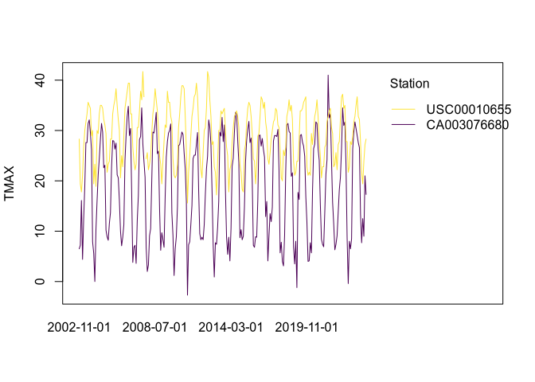

Daily Weather Data
================

``` r
library(GHCNr)
library(terra)  # for handling countries geometries
#> terra 1.7.83
```

# Select GHCNd stations

The station inventory file of GHCNd is stored at
<https://www.ncei.noaa.gov/products/land-based-station/global-historical-climatology-network-daily>.
The function `stations()` can read from this source or from a local
file, specified with `filename`. The inventory can also be downloaded to
a file using `download_inventory()`.

``` r
inventory_file <- download_inventory("~/Downloads/ghcn-inventory.txt")
stations <- stations(inventory_file, variables = "TMAX")
```

``` r
stations <- stations(variables = "TMAX")
```

By specifying `variables = "TMAX"` only the stations that recorded that
variable are kept. Available variables implemented at the moment are
precipitation (“PRCP”), minimum temperature (“TMIN”), and maximum
temperature (“TMAX”).

Stations spanning a time range can be filtered easily.

``` r
stations <- stations[stations$startYear <= 1990, ]
stations <- stations[stations$endYear >= 2000, ]
stations
#> # A tibble: 16,763 × 6
#>    station     latitude longitude variable startYear endYear
#>    <chr>          <dbl>     <dbl> <chr>        <dbl>   <dbl>
#>  1 AE000041196     25.3     55.5  TMAX          1944    2024
#>  2 AEM00041194     25.3     55.4  TMAX          1983    2024
#>  3 AEM00041217     24.4     54.7  TMAX          1983    2024
#>  4 AFM00040938     34.2     62.2  TMAX          1973    2020
#>  5 AFM00040948     34.6     69.2  TMAX          1966    2021
#>  6 AFM00040990     31.5     65.8  TMAX          1973    2020
#>  7 AG000060390     36.7      3.25 TMAX          1940    2024
#>  8 AG000060590     30.6      2.87 TMAX          1940    2024
#>  9 AG000060611     28.0      9.63 TMAX          1958    2024
#> 10 AG000060680     22.8      5.43 TMAX          1940    2004
#> # ℹ 16,753 more rows
```

Spatial filters can also be easily applied. Spatial boundaries of
countries can be downloaded from <https://www.geoboundaries.org/> using
the `get_countr(couuntry_code = ...)` function, where `country_code` is
the ISO3 code.

``` r
italy <- get_country("ITA")
```

`get_countries()` can take several ISO3 codes to return a geometry of
multiple countries.

``` r
stations <- filter_stations(stations, italy)
plot(italy)
points(stations[, c("longitude", "latitude")], pch = 20, col = "dodgerblue")
```

<!-- -->

# Download daily timeseries

Daily timeseries for a station can be downloaded using the `daily()`
function. In addition to the station ID, `daily()` needs start and end
dates of the timeseries. These should be provided as strings with the
format “YYYY-mm-dd”, e.g., “1990-01-01”.

``` r
daily_ts <- daily(
  stations$station[1],
  paste("1990", "01", "01", sep = "-"),  # shorten a bit as example
  paste(stations$endYear[1], "12", "21", sep = "-"),
  variables = "tmin"
)
daily_ts
#> # A tibble: 12,740 × 4
#>    date       station      tmin tmin_flag
#>  * <date>     <chr>       <dbl> <chr>    
#>  1 1990-01-01 IT000016090  -6.1 ""       
#>  2 1990-01-02 IT000016090  -5.2 ""       
#>  3 1990-01-03 IT000016090  -6.7 ""       
#>  4 1990-01-04 IT000016090  -7   ""       
#>  5 1990-01-05 IT000016090  -7.2 ""       
#>  6 1990-01-06 IT000016090  -6.1 ""       
#>  7 1990-01-07 IT000016090  -6   ""       
#>  8 1990-01-08 IT000016090  -9   ""       
#>  9 1990-01-09 IT000016090  -5   ""       
#> 10 1990-01-10 IT000016090  -5.1 ""       
#> # ℹ 12,730 more rows
```

Multiple stations can also be downloaded at once. Too many stations will
cause the API to fail.

``` r
daily_ts <- daily(
  stations$station,
  paste("1990", "01", "01", sep = "-"),  # shorten a bit as example
  paste("1991", "12", "31", sep = "-"),  # shorten a bit as example
  variables = "tmin"
)
daily_ts
#> # A tibble: 29,114 × 4
#>    date       station      tmin tmin_flag
#>  * <date>     <chr>       <dbl> <chr>    
#>  1 1990-01-01 IT000016090  -6.1 ""       
#>  2 1990-01-02 IT000016090  -5.2 ""       
#>  3 1990-01-03 IT000016090  -6.7 ""       
#>  4 1990-01-04 IT000016090  -7   ""       
#>  5 1990-01-05 IT000016090  -7.2 ""       
#>  6 1990-01-06 IT000016090  -6.1 ""       
#>  7 1990-01-07 IT000016090  -6   ""       
#>  8 1990-01-08 IT000016090  -9   ""       
#>  9 1990-01-09 IT000016090  -5   ""       
#> 10 1990-01-10 IT000016090  -5.1 ""       
#> # ℹ 29,104 more rows
plot(daily_ts, "tmin")
```

<!-- -->

Note the outliers, which are due to flagged records (see below).

Implmented variables are “tmin”, “tmax”, and “prcp”. `daily()` returns a
table with the value of the variable chosen and associated flags.

## Remove flagged records

Flagged records can be removed using `remove_flagged()`. In
`remove_flagged()` the argument `strict` (dafault = `FALSE`) specifies
which flags to include. Flags always removed are:

    #> $D
    #> [1] "duplicate flag"
    #> 
    #> $I
    #> [1] "consistency flag"
    #> 
    #> $K
    #> [1] "streak flag"
    #> 
    #> $M
    #> [1] "mega flag"
    #> 
    #> $N
    #> [1] "naught flag"
    #> 
    #> $R
    #> [1] "lagged range flag"
    #> 
    #> $X
    #> [1] "bounds flag"

Whereas setting `strict = TRUE` will cause additional flags to be
removed.

    #> $O
    #> [1] "outlier flag"
    #> 
    #> $G
    #> [1] "gap flag"
    #> 
    #> $L
    #> [1] "multiday flag"
    #> 
    #> $S
    #> [1] "spatial consistency flag"
    #> 
    #> $Z
    #> [1] "Datzilla flag"

This will also remove the "\*\_flag=" column.

``` r
daily_ts <- remove_flagged(daily_ts)
#> Removing 9 flagged record(s):
#>  - 7 consistency flag(s)
#>  - 2 bounds flag(s)
plot(daily_ts, "tmin")
```

<!-- -->

# Temporal coverage

Coverage of the timeseries can be calculated using `coverage()`.

``` r
station_coverage <- coverage(daily_ts)
```

The output is a table with coverage by month and year
(`monthly_coverage`), by year (`annual_coverage`), and for the whole
time period (`period_coverage`). `annual_coverage` is constant within
the same year and `year` is always a constant. This table is useful to
inspect stations that may have problematic timeseries, such as

``` r
station_coverage[station_coverage$annual_coverage_tmin < 0.5, ]
#> # A tibble: 192 × 6
#>    station      year month monthly_coverage_tmin annual_coverage_tmin
#>    <chr>       <dbl> <dbl>                 <dbl>                <dbl>
#>  1 IT000016232  1990     1                     0                    0
#>  2 IT000016232  1990     2                     0                    0
#>  3 IT000016232  1990     3                     0                    0
#>  4 IT000016232  1990     4                     0                    0
#>  5 IT000016232  1990     5                     0                    0
#>  6 IT000016232  1990     6                     0                    0
#>  7 IT000016232  1990     7                     0                    0
#>  8 IT000016232  1990     8                     0                    0
#>  9 IT000016232  1990     9                     0                    0
#> 10 IT000016232  1990    10                     0                    0
#> # ℹ 182 more rows
#> # ℹ 1 more variable: period_coverage_tmin <dbl>
```

Note that missing years are not shown and that `year_coverage` only
calculates the number of years that have been covered. `period_coverage`
calculates the coverage across the whole period, including missing
years.

<!-- -->

# Monthly and annual timeseries, climatological normals

The functions `monthly()`, `annual()` nad `normal()` summarized the
weather time series to monthly and annual time series and to
climatological normal (long-term averages), respectively. Summaries are
calculated as follows:

-   $T_{min}$ is the minimum daily temperature recorded in the month or
    the year.
-   $T_{max}$ is the maximum daily temperature recorded in the month or
    the year.
-   $Prcp$ is the cumulative precipitation during the month or year.

`NA`s are removed during calculation.

``` r
monthly_ts <- monthly(daily_ts)
monthly_ts
#> # A tibble: 966 × 4
#>    station      year month  tmin
#>  * <chr>       <dbl> <dbl> <dbl>
#>  1 IT000016090  1990     1  -9  
#>  2 IT000016090  1990     2  -4.2
#>  3 IT000016090  1990     3  -3.5
#>  4 IT000016090  1990     4   0.9
#>  5 IT000016090  1990     5   7.5
#>  6 IT000016090  1990     6   7.5
#>  7 IT000016090  1990     7  12.9
#>  8 IT000016090  1990     8  15.4
#>  9 IT000016090  1990     9   7.7
#> 10 IT000016090  1990    10   0  
#> # ℹ 956 more rows
plot(monthly_ts, "tmin")
```

<!-- -->

``` r
annual_ts <- annual(daily_ts)
annual_ts
#> # A tibble: 81 × 3
#>    station      year  tmin
#>  * <chr>       <dbl> <dbl>
#>  1 IT000016090  1990  -9  
#>  2 IT000016090  1991 -12.5
#>  3 IT000016134  1990 -13.4
#>  4 IT000016134  1991 -21  
#>  5 IT000016232  1990  NA  
#>  6 IT000016232  1991  NA  
#>  7 IT000016239  1990  -2.4
#>  8 IT000016239  1991  -4  
#>  9 IT000016320  1990   0.4
#> 10 IT000016320  1991  -2  
#> # ℹ 71 more rows
plot(annual_ts, "tmin")
```

<!-- -->

``` r
# normals <- normal(daily_ts) # to be implemented
```
