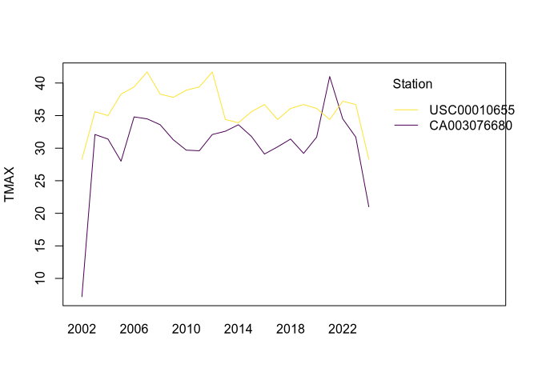

Daily Weather Data
================

``` r
library(GHCNr)
library(terra)  # for handling countries geometries
```

# Select GHCNd stations

The station inventory file of GHCNd is stored at
<https://www.ncei.noaa.gov/products/land-based-station/global-historical-climatology-network-daily>.
The function `stations()` can read from this source or from a local
file, specified with `filename`. The inventory can also be downloaded to
a file using `download_inventory()`.

``` r
inventory_file <- download_inventory("~/Downloads/ghcn-inventory.txt")
s <- stations(
  inventory_file,
  variables = "TMAX",
  first_year = 1990,
  last_year = 2000
)
```

``` r
s <- stations(variables = "TMAX", first_year = 1990, last_year = 2000)
s
# A tibble: 16,763 × 6
   station     latitude longitude variable firstYear lastYear
   <chr>          <dbl>     <dbl> <chr>        <dbl>    <dbl>
 1 AE000041196     25.3     55.5  TMAX          1944     2024
 2 AEM00041194     25.3     55.4  TMAX          1983     2024
 3 AEM00041217     24.4     54.7  TMAX          1983     2024
 4 AFM00040938     34.2     62.2  TMAX          1973     2020
 5 AFM00040948     34.6     69.2  TMAX          1966     2021
 6 AFM00040990     31.5     65.8  TMAX          1973     2020
 7 AG000060390     36.7      3.25 TMAX          1940     2024
 8 AG000060590     30.6      2.87 TMAX          1940     2024
 9 AG000060611     28.0      9.63 TMAX          1958     2024
10 AG000060680     22.8      5.43 TMAX          1940     2004
# ℹ 16,753 more rows
# ℹ Use `print(n = ...)` to see more rows
```

By specifying `variables = "TMAX"` only the stations that recorded that
variable are kept. Available variables implemented at the moment are
precipitation (“PRCP”), minimum temperature (“TMIN”), and maximum
temperature (“TMAX”). The arguments `first_year` and `last_year` specify
the minimum time period required for the stations. Here, stations that
are not sampled at least from 1990 until at least 2000 are dropped.

``` r

Spatial filters can also be easily applied.
Spatial boundaries of countries can be downloaded from <https://www.geoboundaries.org/> using the `get_countr(couuntry_code = ...)` function, where `country_code` is the ISO3 code.
```

``` r
italy <- get_country("ITA")
```

`get_countries()` can take several ISO3 codes to return a geometry of
multiple countries.

``` r
s <- filter_stations(s, italy)
s
# A tibble: 41 × 6
   station     latitude longitude variable firstYear lastYear
   <chr>          <dbl>     <dbl> <chr>        <dbl>    <dbl>
 1 IT000016090     45.4     10.9  TMAX          1951     2024
 2 IT000016134     44.2     10.7  TMAX          1951     2024
 3 IT000016232     42       15    TMAX          1975     2024
 4 IT000016239     41.8     12.6  TMAX          1951     2024
 5 IT000016320     40.6     17.9  TMAX          1951     2024
 6 IT000016560     39.2      9.05 TMAX          1951     2024
 7 IT000160220     46.2     11.0  TMAX          1951     2024
 8 IT000162240     42.1     12.2  TMAX          1954     2024
 9 IT000162580     41.7     16.0  TMAX          1951     2024
10 ITE00100554     45.5      9.19 TMAX          1763     2008
# ℹ 31 more rows
# ℹ Use `print(n = ...)` to see more rows
```

# Download daily timeseries

Daily timeseries for a station can be downloaded using the `daily()`
function. In addition to the station ID, `daily()` needs start and end
dates of the timeseries. These should be provided as strings with the
format “YYYY-mm-dd”, e.g., “1990-01-01”.

``` r
daily_ts <- daily(
  station_id = "CA003076680",
  start_date = paste("2002", "11", "01", sep = "-"),
  end_date = paste("2024", "04", "22", sep = "-"),
  variables = "tmax"
)
daily_ts
```

    #> # A tibble: 7,574 × 4
    #>    date       station      tmax tmax_flag
    #>    <date>     <chr>       <dbl> <chr>    
    #>  1 2002-11-01 CA003076680   4.7 ""       
    #>  2 2002-11-02 CA003076680   6.5 ""       
    #>  3 2002-11-03 CA003076680   6.2 ""       
    #>  4 2002-11-04 CA003076680   6.3 ""       
    #>  5 2002-12-09 CA003076680   3.8 ""       
    #>  6 2002-12-10 CA003076680   2.9 ""       
    #>  7 2002-12-11 CA003076680   3.7 ""       
    #>  8 2002-12-12 CA003076680   5   ""       
    #>  9 2002-12-13 CA003076680   7.2 ""       
    #> 10 2002-12-14 CA003076680   3.7 ""       
    #> # ℹ 7,564 more rows

Multiple stations can also be downloaded at once. Too many stations will
cause the API to fail.

``` r
daily_ts <- daily(
  station_id = c("CA003076680", "USC00010655"),
  start_date = paste("2002", "11", "01", sep = "-"),
  end_date = paste("2024", "04", "22", sep = "-"),
  variables = "tmax"
)
plot(daily_ts, "tmax")
```

<!-- -->

Implmented variables are “tmin”, “tmax”, and “prcp”. `daily()` returns a
table with the value of the variable chosen and associated flags.

## Remove flagged records

Flagged records can be removed using `remove_flagged()`. In
`remove_flagged()` the argument `strict` (dafault = `TRUE`) specifies
which flags to include. The flags removed are:

    #> $D
    #> [1] "duplicate flag"
    #> 
    #> $I
    #> [1] "consistency flag"
    #> 
    #> $K
    #> [1] "streak flag"
    #> 
    #> $M
    #> [1] "mega flag"
    #> 
    #> $N
    #> [1] "naught flag"
    #> 
    #> $R
    #> [1] "lagged range flag"
    #> 
    #> $X
    #> [1] "bounds flag"
    #> 
    #> $O
    #> [1] "outlier flag"
    #> 
    #> $G
    #> [1] "gap flag"
    #> 
    #> $L
    #> [1] "multiday flag"
    #> 
    #> $S
    #> [1] "spatial consistency flag"
    #> 
    #> $Z
    #> [1] "Datzilla flag"

Setting `strict = FALSE` will only remove the flags:

    #> $D
    #> [1] "duplicate flag"
    #> 
    #> $I
    #> [1] "consistency flag"
    #> 
    #> $K
    #> [1] "streak flag"
    #> 
    #> $M
    #> [1] "mega flag"
    #> 
    #> $N
    #> [1] "naught flag"
    #> 
    #> $R
    #> [1] "lagged range flag"
    #> 
    #> $X
    #> [1] "bounds flag"

This will also remove the “\*\_flag=” column.

``` r
daily_ts <- remove_flagged(daily_ts)
#> Removing 1 flagged record(s):
#>  - 1 spatial consistency flag(s)
plot(daily_ts, "tmax")
```

<!-- -->

# Temporal coverage

Coverage of the timeseries can be calculated using `coverage()`.

``` r
station_coverage <- coverage(daily_ts)
station_coverage
#> # A tibble: 515 × 6
#>    station      year month monthly_coverage_tmax annual_coverage_tmax
#>    <chr>       <dbl> <dbl>                 <dbl>                <dbl>
#>  1 CA003076680  2002    11                 0.133                0.426
#>  2 CA003076680  2002    12                 0.710                0.426
#>  3 CA003076680  2003     1                 0.871                0.937
#>  4 CA003076680  2003     2                 0.929                0.937
#>  5 CA003076680  2003     3                 0.839                0.937
#>  6 CA003076680  2003     4                 0.867                0.937
#>  7 CA003076680  2003     5                 0.935                0.937
#>  8 CA003076680  2003     6                 1                    0.937
#>  9 CA003076680  2003     7                 1                    0.937
#> 10 CA003076680  2003     8                 1                    0.937
#> # ℹ 505 more rows
#> # ℹ 1 more variable: period_coverage_tmax <dbl>
```

`period_coverage_*` calculates the coverage across the whole period,
including missing years.

The output is a table with coverage by month and year
(`monthly_coverage`), by year (`annual_coverage`), and for the whole
time period (`period_coverage`). `annual_coverage` is constant within
the same year and `year` is always a constant. This table is useful to
inspect stations that may have problematic timeseries, such as

``` r
unique(station_coverage[
  station_coverage$annual_coverage_tmax < .95,
  c("station", "year", "annual_coverage_tmax")
])
#> # A tibble: 11 × 3
#>    station      year annual_coverage_tmax
#>    <chr>       <dbl>                <dbl>
#>  1 CA003076680  2002                0.426
#>  2 CA003076680  2003                0.937
#>  3 CA003076680  2004                0.929
#>  4 CA003076680  2010                0.942
#>  5 CA003076680  2012                0.918
#>  6 CA003076680  2013                0.901
#>  7 CA003076680  2016                0.825
#>  8 CA003076680  2017                0.882
#>  9 CA003076680  2023                0.868
#> 10 CA003076680  2024                0.885
#> 11 USC00010655  2007                0.912
```

# Monthly and annual timeseries, climatological normals

The functions `monthly()`, `quarterly()`, and `annual()` summarized the
weather time series to monthly, quarterly, and annual time series,
respectively. Summaries are calculated as follows:

- $T_{min}$ is the minimum daily temperature recorded in the month or
  the year.
- $T_{max}$ is the maximum daily temperature recorded in the month or
  the year.
- $Prcp$ is the cumulative precipitation during the month or year.

`NA`s are removed during calculation.

``` r
monthly_ts <- monthly(daily_ts)
monthly_ts
#> # A tibble: 515 × 4
#>    station      year month  tmax
#>  * <chr>       <dbl> <dbl> <dbl>
#>  1 CA003076680  2002    11   6.5
#>  2 CA003076680  2002    12   7.2
#>  3 CA003076680  2003     1  16.1
#>  4 CA003076680  2003     2   4.4
#>  5 CA003076680  2003     3  12.5
#>  6 CA003076680  2003     4  18.9
#>  7 CA003076680  2003     5  27.6
#>  8 CA003076680  2003     6  27.6
#>  9 CA003076680  2003     7  31.4
#> 10 CA003076680  2003     8  32.1
#> # ℹ 505 more rows
plot(monthly_ts, "tmax")
```

<!-- -->

``` r
quarterly_ts <- quarterly(daily_ts)
quarterly_ts
#> # A tibble: 174 × 4
#>    station      year quarter  tmax
#>  * <chr>       <dbl>   <dbl> <dbl>
#>  1 CA003076680  2002       4   7.2
#>  2 CA003076680  2003       1  16.1
#>  3 CA003076680  2003       2  27.6
#>  4 CA003076680  2003       3  32.1
#>  5 CA003076680  2003       4  29.6
#>  6 CA003076680  2004       1  16  
#>  7 CA003076680  2004       2  28.3
#>  8 CA003076680  2004       3  31.4
#>  9 CA003076680  2004       4  23.1
#> 10 CA003076680  2005       1  13.7
#> # ℹ 164 more rows
plot(quarterly_ts, "tmax")
```

<!-- -->

``` r
annual_ts <- annual(daily_ts)
annual_ts
#> # A tibble: 46 × 3
#>    station      year  tmax
#>  * <chr>       <dbl> <dbl>
#>  1 CA003076680  2002   7.2
#>  2 CA003076680  2003  32.1
#>  3 CA003076680  2004  31.4
#>  4 CA003076680  2005  28  
#>  5 CA003076680  2006  34.8
#>  6 CA003076680  2007  34.5
#>  7 CA003076680  2008  33.6
#>  8 CA003076680  2009  31.3
#>  9 CA003076680  2010  29.7
#> 10 CA003076680  2011  29.6
#> # ℹ 36 more rows
plot(annual_ts, "tmax")
```

<!-- -->
