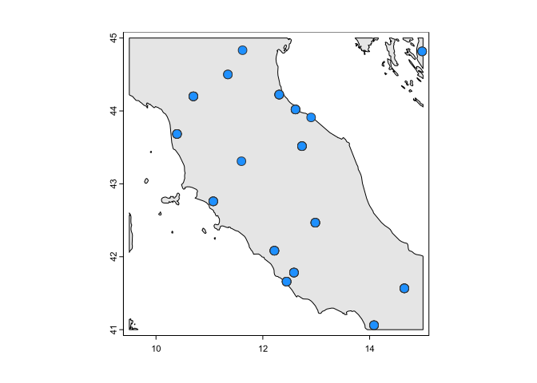
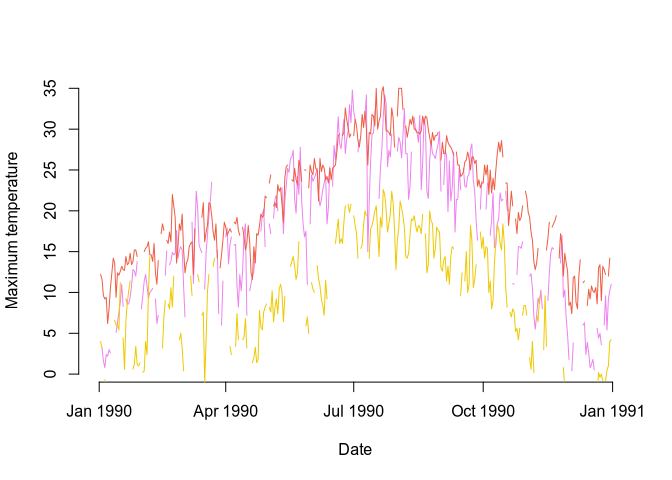

<!-- README.md is generated from README.Rmd. Please edit that file -->

<!-- `devtools::build_readme()` -->

# GHCNr

<!-- badges: start -->

<!-- badges: end -->

``` r
library(terra)
#> terra 1.7.78
library(GHCNr)

world <- vect("~/Documents/ne_10m_land.shp")
roi <- ext(9.5, 15, 41, 45)
roi <- crop(world, roi)
s <- stations(roi, show = TRUE)
#>  - Downloading stations inventory
s <- s[s$dataType == "TAVG", ]  # only stations with tavg

# foxus on 3 stations only
points(
  s[7:9],
  col = "grey20", bg = c("violet", "tomato2", "gold"),
  pch = 23, cex = 2
)
```



``` r
d <- daily(unique(s$id)[7:9], "1990-01-01", "1990-12-31")
daily_coverage(d)
#> # A tibble: 3 × 6
#>   station      prcp  tavg  tmax  tmin  snwd
#>   <chr>       <dbl> <dbl> <dbl> <dbl> <dbl>
#> 1 ITM00016179 0.134 0.989 0.819 0.789 0    
#> 2 ITM00016206 0.753 1     0.899 0.740 0    
#> 3 ITM00016219 0.625 1     0.742 0.537 0.318
with(
  subset(d, station == unique(d$station)[1]),
  plot(
    date,
    tmax / 10,
    col = "violet",
    type = "l",
    frame = FALSE,
    xlab = "Date",
    ylab = "Maximum temperature"
  )
)
with(
  subset(d, station == unique(d$station)[2]),
  lines(date, tmax / 10, col = "tomato2")
)
with(
  subset(d, station == unique(d$station)[3]),
  lines(date, tmax / 10, col = "gold2")
)
```


