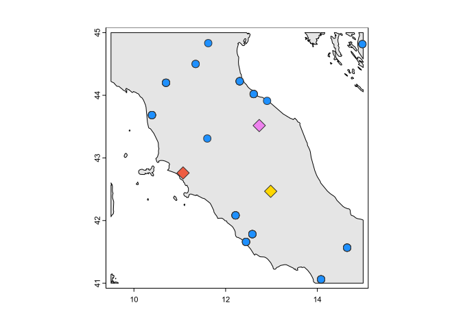

<!-- README.md is generated from README.Rmd. Please edit that file -->

<!-- You'll still need to render `README.Rmd` regularly, to keep `README.md` up-to-date. `devtools::build_readme()` is handy for this. -->

# meteostatr

<!-- badges: start -->

<!-- badges: end -->

``` r
library(terra)
#> terra 1.7.78
library(meteostatr)

world <- vect("~/Documents/ne_10m_land.shp")
roi <- ext(9.5, 15, 41, 45)
roi <- crop(world, roi)
s <- stations(roi, show = TRUE)
#>  - Downloading stations inventory
```



``` r
d <- daily(unique(s$id)[1:3], "1990-01-01", "2010-12-31")
daily_coverage(d)
#> # A tibble: 3 × 6
#>   station      prcp  tmax  tmin      snwd   tavg
#>   <chr>       <dbl> <dbl> <dbl>     <dbl>  <dbl>
#> 1 HRE00105227 0.870 0.870 0.870 NA        NA    
#> 2 IT000016134 0.403 0.767 0.760  0.237     0.729
#> 3 IT000016239 0.834 0.758 0.884  0.000119  0.911
plot(d$date, d$tmax, col = as.factor(d$station))
```


